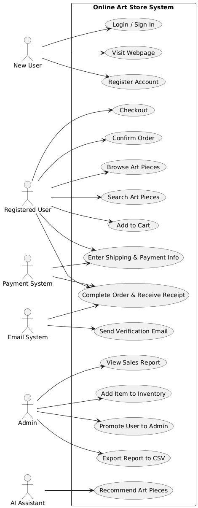

# 🖼️ Use Case Diagram – Online Art Store System

This use case diagram shows how different users and systems interact with the Online Art Store System.  
It includes the major features for all project versions (V1–V3), including AI art recommendations.

---

## Use Case Diagram

