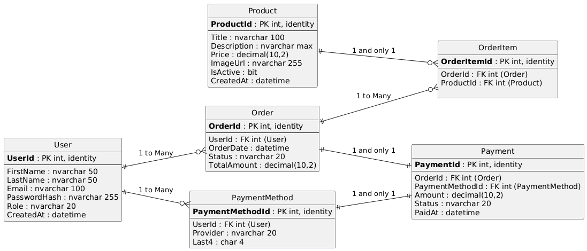

# Technical Design
## Table of Contents
- [Implementation Language](#implementation-language)
- [Implementation Framework](#implementation-framework)
- [Data Storage Plan](#data-storage-plan)
- [Entity Relationship Diagram](#entity-relationship-diagram)
- [Entity/Field Descriptions](#entityfield-descriptions)
- [Data Examples](#data-examples)
- [Database Seed Data](#database-seed-data)
- [Authentication and Authorization Plan](#authentication-and-authorization-plan)
- [Coding Style Guide](#coding-style-guide)

## Implementation Language
Java
- Mainly chosen since its known by all members of the team.
- Java is also well supported, like with the IntelliJ IDE and the following framework

HTML and CSS
- Prolific language for web, we will be using it as well
## Implementation Framework
Springboot
- The main framework of the project used for creating Spring applications
- Built to be more "opinionated" and less flexible but easier, better for a starter project
## Data Storage Plan
SQLite
- SQlite is being used so as stated in the instructions JDBC will be used
- JDBC or Java Database Connectivity does as its name applies and actions to interface SQLite and Java
## Entity Relationship Diagram

## Entity/Field Descriptions
[Table of Field Descriptions](assets/table-of-field-descriptions.pdf)
## Data Examples
.png)
## Database Seed Data
.png)
## Authentication and Authorization Plan
## Coding Style Guide
### Naming Conventions
camelCase
- first letter of the first word lower, following first letters are capital. No spacing
- Java Methods, Java Functions, and Java Variables


PascalCase
- first letter of all words capital. No spacing
- Java Files and Java Classes

kabab-case
- spaces denoted by hypens
- other files, HTML and CSS classes
### Braces and Indentation
- first brace "{" should directly follow statement 
- the ending brace "}" should come on the line the nesting
- if a statement follows the previous like else or catch if should direct follow its ending brace "}".

ex.
```
if (x > 0) {
    x = 5
} else {
    x = 0
}
```

### Comments
- Comments refrencing multiple lines are place on the line before
- Comments refrencing a single line are place directly after on the same line

