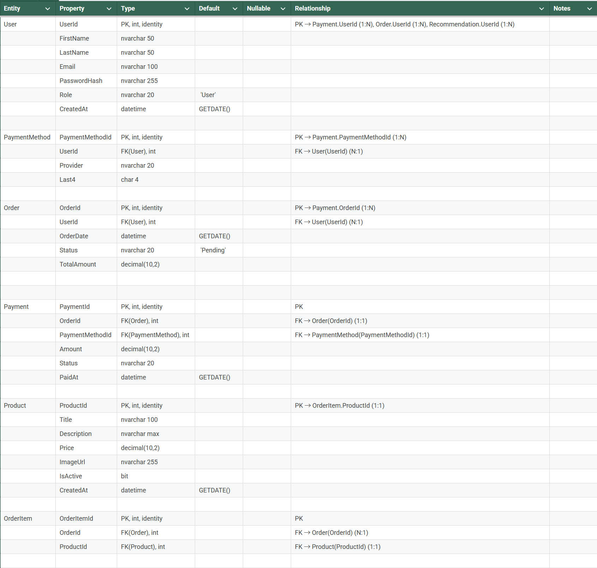
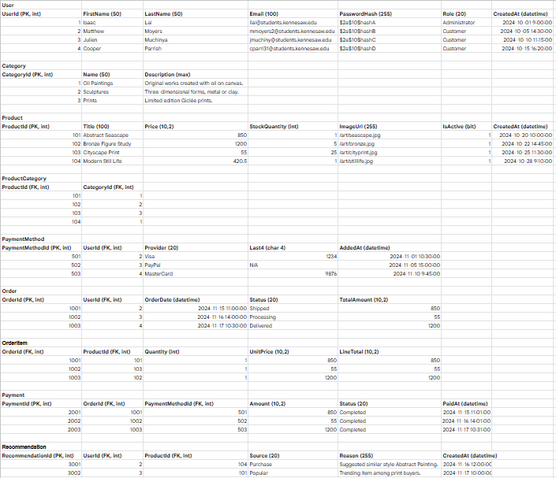
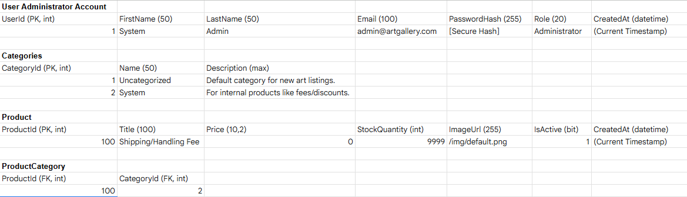
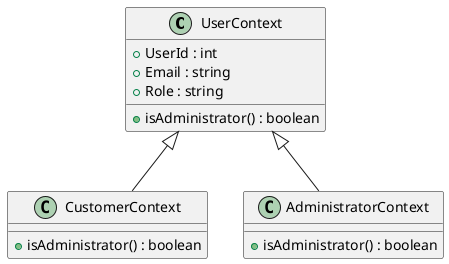

# Technical Design
## Table of Contents
- [Implementation Language](#implementation-language)
- [Implementation Framework](#implementation-framework)
- [Data Storage Plan](#data-storage-plan)
- [Entity Relationship Diagram](#entity-relationship-diagram)
- [Entity/Field Descriptions](#entityfield-descriptions)
- [Data Examples](#data-examples)
- [Database Seed Data](#database-seed-data)
- [Authentication and Authorization Plan](#authentication-and-authorization-plan)
- [Coding Style Guide](#coding-style-guide)

## Implementation Language
Java
- Mainly chosen since its known by all members of the team.
- Java is also well supported, like with the IntelliJ IDE and the following framework

HTML and CSS
- Prolific language for web, we will be using it as well
## Implementation Framework
Springboot
- The main framework of the project used for creating Spring applications
- Built to be more "opinionated" and less flexible but easier, better for a starter project
## Data Storage Plan
SQLite
- SQlite is being used so as stated in the instructions JDBC will be used
- JDBC or Java Database Connectivity does as its name applies and actions to interface SQLite and Java
## Entity Relationship Diagram

## Entity/Field Descriptions

## Data Examples

## Database Seed Data

## Authentication and Authorization Plan
---
This section describes how the system identifies whether a user is a **Customer** or an **Administrator**, and how their actions are authorized. The application uses **one login screen** for all users, so authentication (identity) and authorization (permissions) are handled separately.


## Authentication (Identify Who Is Logging In)

User information is stored in the `User` table, which includes login credentials and the role assigned to the user.

### User Table Structure

| Field          | Type              |
|----------------|-------------------|
| `UserId`       | int               |
| `Email`        | nvarchar(100)     |
| `PasswordHash` | nvarchar(255)     |
| `Role`         | nvarchar(20)      |

The `Role` field determines whether the user is a `"Customer"` or an `"Administrator"`.

### Login Flow (Java + Spring Boot + JDBC + SQLite)

1. The user submits `Email` and `Password` to the `/login` endpoint.
2. The backend queries the database:

   ```sql
   SELECT UserId, Email, PasswordHash, Role
   FROM User
   WHERE Email = ?;
   ```

3. If a matching record is found, the backend verifies the provided password using a password hashing library (such as bcrypt).
4. If the password is valid, the backend creates an authenticated session (or token) containing:
   - `UserId`
   - `Email`
   - `Role`
5. If authentication fails, the request is rejected.

### Authentication Code Example (Java)

```java
User user = userRepository.findByEmail(email);
if (user == null || !passwordEncoder.matches(rawPassword, user.getPasswordHash())) {
    throw new AuthenticationException("Invalid E-Mail or Password");
}

AuthSession session = new AuthSession(
    user.getUserId(),
    user.getEmail(),
    user.getRole()
);
```

---

## Authorization (Define What the Authenticated User Can Do)

Authorization is handled separately after authentication.  
The session created during login is attached to each request and contains the user’s `Role`.  
Role-based logic determines which actions the user can perform.

### Role Permissions

#### Customer
- Browse and search products
- Add items to cart
- Place orders
- View their own orders

#### Administrator
- All Customer capabilities
- Add, edit, and remove products
- Manage inventory
- View and export sales reports
- Promote users to Administrator

### Authorization Flow

For each backend operation:

1. Verify the request contains a valid authenticated session.
2. Read the `Role` value from the session.
3. Compare the role with the access level required by the endpoint.
4. If the user lacks the required permissions, return a "Forbidden" response.

### Authorization Code Example (Java)

```java
void requireAdministrator(AuthSession session) {
    if (!"Administrator".equals(session.getRole())) {
        throw new AuthorizationException("Administrator privileges required");
    }
}
```

---


If the application uses polymorphism to handle roles, each authenticated user is wrapped in a context object representing its specific role.
## Polymorphism-Based Role Handling (Class Diagram Included)
 


- `CustomerContext.isAdministrator()` returns **false**  
- `AdministratorContext.isAdministrator()` returns **true**  
- Controllers check permissions by calling:

```
userContext.isAdministrator()
```

---


## Coding Style Guide
### Naming Conventions
camelCase
- first letter of the first word lower, following first letters are capital. No spacing
- Java Methods, Java Functions, and Java Variables


PascalCase
- first letter of all words capital. No spacing
- Java Files and Java Classes

kabab-case
- spaces denoted by hypens
- other files, HTML and CSS classes
### Braces and Indentation
- first brace "{" should directly follow statement 
- the ending brace "}" should come on the line the nesting
- if a statement follows the previous like else or catch if should direct follow its ending brace "}".

ex.
```
if (x > 0) {
    x = 5
} else {
    x = 0
}
```

### Comments
- Comments refrencing multiple lines are place on the line before
- Comments refrencing a single line are place directly after on the same line

## Presentation
[Loom Video](https://www.loom.com/share/6d75bb58f5484b49b4eac880c0a7d361)

This 4 minute video provides a brief rundown of the Technical Design stage of the project.
